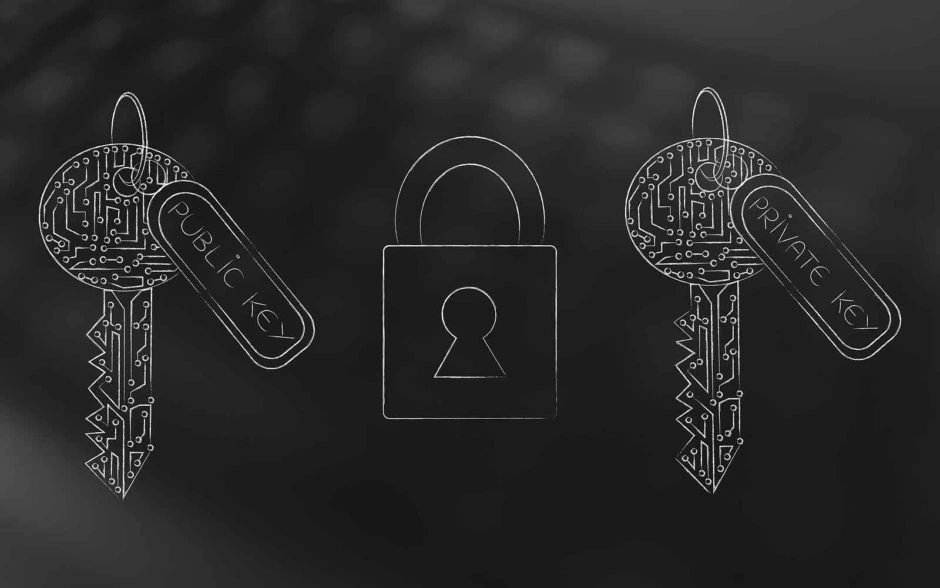
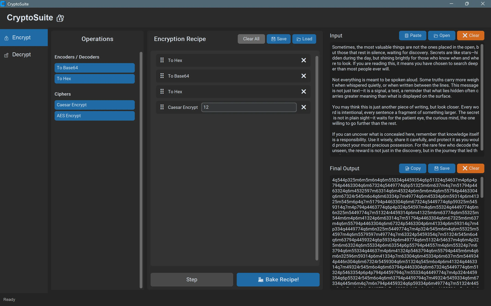
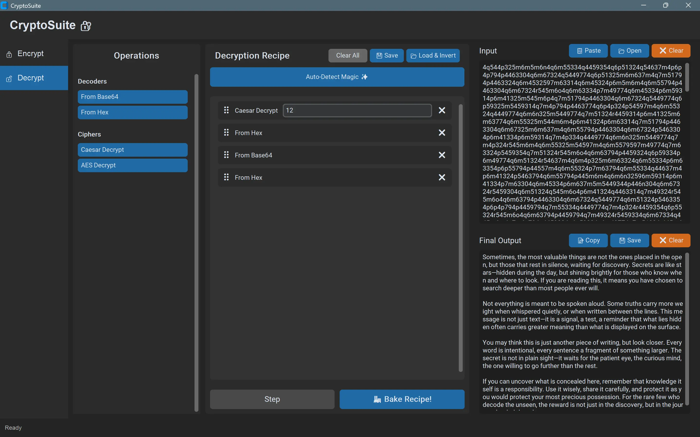
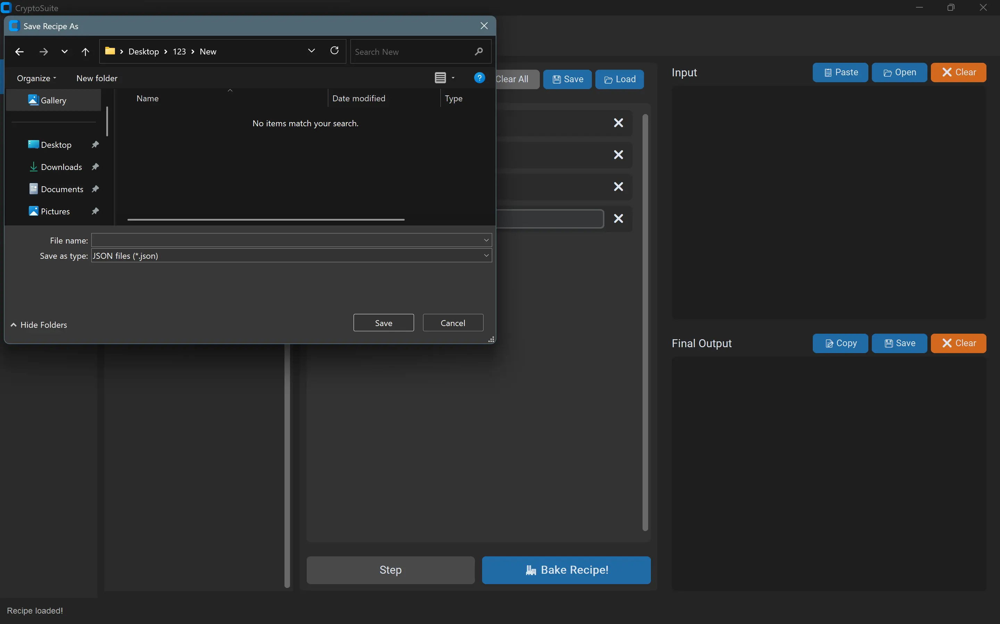
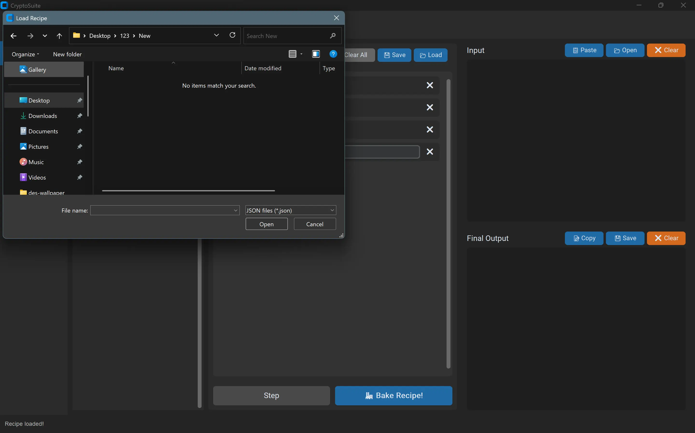

<div align="center">

# CryptoSuite 🔐


[](https://opensource.org/licenses/MIT)
[](https://github.com/sh4dowkey/CryptoSuite)




</div>

<br>

> **CryptoSuite** — a lightweight, extensible cryptography toolkit written in **Python**. Designed for clarity and ease-of-use with a focus on modularity and learning.
> *Work in Progress — currently implements Base64 encode/decode.* 🚧


---


## ✨ Why CryptoSuite?

CryptoSuite simplifies cryptographic tasks into a clear, step-by-step **recipe workflow**.

It’s designed for students, developers, and security enthusiasts who need a practical yet approachable tool.

CryptoSuite makes cryptography accessible.

---


## 🛠️  Features

**🚧 Available now**
- Recipe-based system: chain multiple operations in sequence
- Base64 encode & decode , HEX encode & decode , Cipher
- Save and load recipes  
- Dark-themed GUI with separate encrypt/decrypt panels  

**🚧 Planned / Work in progress**
- Auto-Detect mode ✨: analyze input and suggest operations  
- AES encryption & decryption  
- Classic ciphers  
- Hashing tab (MD5, SHA-256)

> See **Roadmap** below for details.


---


## 🔐 Example Workflows

### ⚡ Encryption & Decryption

<div align="center">
  
  
  <br/>
  <sub>⚡ Encryption</sub>   <sub>🔓 Decryption</sub>
</div>

---

### 📂 Save & Load Recipes

<div align="center">
  
  
  <br/>
  <sub>💾 Save Recipe</sub>   <sub>📂 Load Recipe</sub>
</div>

<br>

> 💡 **Tip:** You can chain multiple encryptions in one recipe for extra security!

---

## 🚀 Quick Start

```bash
# Clone the repo
git clone https://github.com/sh4dowkey/CryptoSuite.git
cd CryptoSuite

# (Optional) create and activate venv
python -m venv .venv
# Windows: .\.venv\Scripts\activate
# macOS/Linux: source .venv/bin/activate

# Install dependencies
pip install -r requirements.txt

# Run the application
python main.py

# This will launch the graphical user interface.
```

---


## 📖 Basic Usage

1.  Launch the application by running `python main.py`.
2.  In the **"Encrypt / Encode"** panel on the left, type your text into the "Input" box.
3.  Click the **"Add Operation"** dropdown and select **"To Base64"**.
4.  The encoded result will instantly appear in the "Output" box.
5.  You can add more operations to the recipe or save the current recipe using the **"Save Recipe"** button.

---


## 🛣️ Roadmap

**v0.1** (current)  
- GUI with encrypt/decrypt panels  
- Base64 encode/decode  
- Recipe system with save/load  

**v0.2**  
- Auto-Detect feature  
- AES cipher integration  
- Unit tests  

**v0.3+**  
- Classic ciphers and hashing  
- Drag-and-drop for recipe steps  
- Expanded documentation and CI  

---


## 🤝 Contributing

Contributions are welcome!  

1. Fork the repo  
2. Create a feature branch (`git checkout -b feat/my-feature`)  
3. Add tests and documentation  
4. Open a Pull Request  

Please keep functions small, documented, and covered by unit tests where possible.

---


## 📝 License

This project is released under the **MIT License**.

---


## 🙏 Acknowledgements

Inspired by community cryptography resources and educational projects.

If you find CryptoSuite useful, please ⭐ the repo and consider contributing!

---
